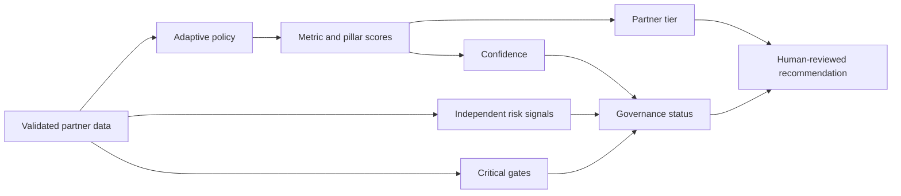

# Adaptive Channel Governance & Partner Scoring Platform

[](https://www.python.org/)
[](tests/)
[](data/sample_partners.csv)

An explainable, policy-driven decision-support MVP for global Sales Operations
and Channel Management teams. It demonstrates how an ambiguous governance
problem can be translated into configurable rules, tested domain logic, and a
runnable product without company data or paid APIs.

> All names, observations, thresholds, policy weights, and business values in
> this repository are synthetic demonstration material. No real partner,
> price, margin, rebate, credit, revenue, or commercial policy data is used.

## Business problem

One-size-fits-all partner evaluation obscures differences between businesses,
countries, lifecycle stages, and partner types. A strong sell-in number may
coexist with excess inventory, deteriorating receivables, weak service
capability, or a critical compliance signal.

This project turns that problem into an auditable decision flow:



## Main functions

- Strict Pydantic data contract with row-level validation feedback
- Business/country/lifecycle-aware YAML policy resolution
- Explainable metric, pillar, and overall partner scoring
- Confidence based on observed weighted inputs; missing data is never zero
- Inventory optimal-band scoring instead of “lower is always better”
- Risk signals reported independently from overall partner quality
- Critical gates capable of holding a high-scoring partner for human review
- Partner tier, governance status, and deterministic support recommendations
- Executive portfolio overview, Partner 360, and data-quality UI
- SQLite schema boundary for later evaluation and audit persistence

The score never automatically determines price, margin, rebate, credit limit,
partner freeze, or termination.

## Run locally

Python 3.12 is the canonical runtime.

### Windows PowerShell

```powershell
python -m venv .venv
.\.venv\Scripts\Activate.ps1
python -m pip install -r requirements.txt
python -m pytest
python -m streamlit run app.py
```

### macOS / Linux

```bash
python3.12 -m venv .venv
source .venv/bin/activate
python -m pip install -r requirements.txt
python -m pytest
python -m streamlit run app.py
```

Open the local URL printed by Streamlit. No API key, database preparation,
cloud account, or manual data download is required.

## Architecture

The Streamlit layer composes application services but contains no scoring,
risk, gate, or tier rules. Domain code is independently testable.

```text
app.py                         Streamlit presentation layer
config/scoring_rules.yaml      Versioned synthetic policy configuration
data/sample_partners.csv       Fictional demonstration observations
src/channel_governance/
  models.py                    Pydantic input/output contracts
  validation.py                DataFrame validation boundary
  policy.py                    Policy loading, inheritance, resolution
  scoring.py                   Normalization, score, confidence
  governance.py                Risk, gates, tier, status, recommendation
  evaluation.py                Application orchestration service
  storage.py                   SQLite schema boundary
tests/                         Unit and end-to-end tests
docs/                          Data contract and verification evidence
AI_USAGE.md                    Truthful AI-assisted development record
```

## Verification

```powershell
python -m pytest
```

Current verified result: **18 tests passed**. Tests include missing data,
normalization boundaries, policy specificity, inventory bands, independent
risk, critical gates, tier boundaries, SQLite setup, and complete portfolio
evaluation. See [Day 1 verification](docs/DAY1_VERIFICATION.md).

## AI-assisted development

AI assisted requirement decomposition, implementation, test generation,
debugging, and documentation. Deterministic business rules remain inspectable
and test-covered, and the core product has no AI runtime dependency. See
[AI_USAGE.md](AI_USAGE.md) for the actual development record and rejected
approaches.

## Roadmap

- Stable now: data contract, policies, scoring, confidence, risk, gates, tiers,
  recommendations, Executive Overview, Partner 360, data-quality view, tests
- Next: scenario simulation and policy comparison
- Later: target rationale, policy/audit UI, optional deterministic or LLM-based
  management narrative

P0 stability and fresh-clone reproducibility take priority over optional
features and artificial line-count expansion.

